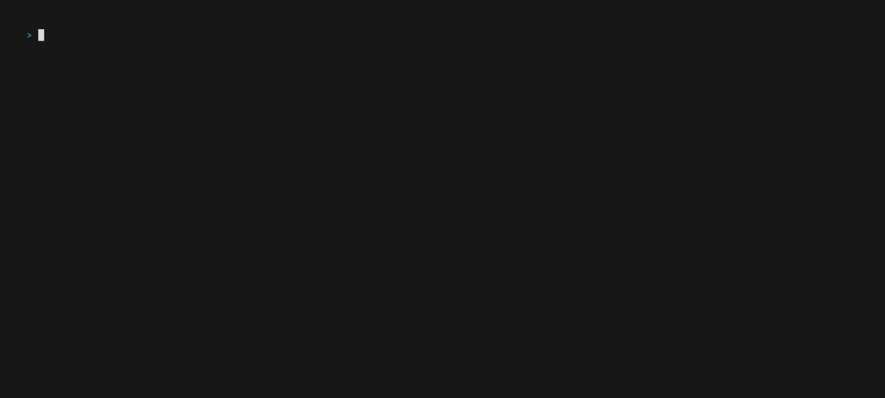

# flat

Measure **UDP** and **TCP** connection latency using `eBPF`.

This repo is the companion to my blog posts about eBPF at <https://thegraynode.io>.

Heavily inspired by [flowlat](https://github.com/markpash/flowlat).
