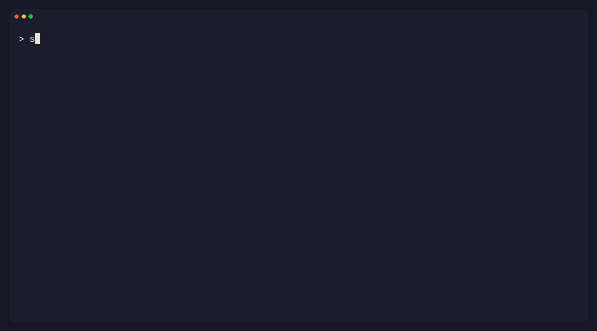

# flat

Measure **UDP** and **TCP** flow latency for both **IPv4** and **IPv6** using `eBPF`.

This repo is the companion to my blog posts about eBPF at <https://thegraynode.io/tags/flat/>.



## Running The Program

You can install **flat** in two ways.

1. Download the [pre-compiled binary](#download-the-pre-compiled-binary)
2. Compile from [source](#compile-from-source)

### Download The Pre-compiled Binary

Download, verify, and install the latest release to `/usr/local/bin` (Linux amd64 or arm64):

```bash
ARCH=$(uname -m | sed 's/x86_64/amd64/; s/aarch64/arm64/') &&
cd "$(mktemp -d)" &&
curl -fLO "https://github.com/pouriyajamshidi/flat/releases/latest/download/flat_linux_${ARCH}.tar.gz" &&
curl -fLO https://github.com/pouriyajamshidi/flat/releases/latest/download/checksums.txt &&
sha256sum -c --ignore-missing checksums.txt &&
tar xf "flat_linux_${ARCH}.tar.gz" flat &&
sudo install flat -D -t /usr/local/bin/
```

Then check out the [examples](#examples).

### Compile From Source

You will need `Go`, `clang`, and the `libbpf` and Linux kernel headers (on Debian/Ubuntu: `sudo apt install clang libbpf-dev linux-libc-dev`).

Clone the repository:

```bash
git clone https://github.com/pouriyajamshidi/flat
```

Change directory to `flat`:

```bash
cd flat
```

> [!TIP]
> Simply run `make` and you will have the `flat` binary. If you do not want to use `make`, keep on reading.

While at the root of project directory, to compile the **C** code and generate the helper functions, run:

```bash
go generate ./...
```

Compile the **Go** program:

```bash
go build -ldflags "-s -w" -o flat cmd/flat.go
```

### Examples

Run it with elevated privileges:

```bash
# Replace eth0 with your desired interface name
sudo flat -i eth0
# Or
sudo flat -i eth0 -ip 1.1.1.1
# Or
sudo flat -i eth0 -port 53
# Or
sudo flat -i eth0 -ip 1.1.1.1 -port 53
```

If you compiled from source, run `sudo ./flat` from the project directory instead.

When both `-ip` and `-port` are given, a flow must match both.

## Flags

**flat** supports four flags at the moment:

| flag  | Description                         |
| ----- | ----------------------------------- |
| -i    | interface to attach the probe to    |
| -ip   | IP address to filter on (optional)  |
| -port | Port number to filter on (optional) |
| -h    | Show help message                   |

---

## Acknowledgments

Heavily inspired by [flowlat](https://github.com/markpash/flowlat).
